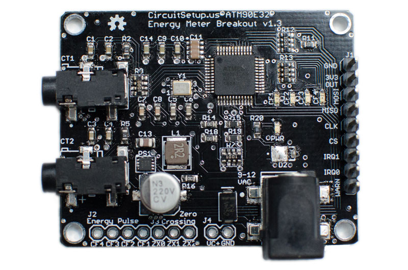

# CircuitSetup Split Single Phase Energy Meter

The CircuitSetup ATM90E32 Split Single Phase Energy Meter can monitor the energy usage in your entire home in real time. It can easily be hooked up to an ESP8266 or ESP32 to wirelessly transmit energy usage data into a program like EmonCMS or ESPHome/Home Assistant. It can also be used to monitor solar power generation to keep track of how much power you are making.

#### With the Split Single Phase Energy Meter you can:

*   **Save Money!**
    *   See exactly how much money you're spending on energy in real time
    *   Find appliances that are using too much electricity
    *   Calculate energy usage for a single room to divide an energy bill fairly among roommates
*   **View & Gather Energy Data**
    *   View the energy usage of your entire home
    *   Track solar power generation (two units required)
    *   Calculate how much it costs to charge your electric vehicle
    *   Remote energy monitoring for vacation or rental properties
    *   Review and graph historical energy data
*   **Be Informed!**
    *   Independent of your power utility's meter
    *   Set up alerts for over or under usage
    *   Prevent surprises on energy bills
    *   View usage data in the EmonCMS Android or iOS apps
    *   Automate notifications with your home automation system like "send my phone a message when the dryer is done", or even "if I leave the house, and the oven is on, send me an alert" (programming required)
*   **Spend less on energy monitoring hardware!**
    *   Affordable but very accurate
    *   Save hundreds over popular monitoring systems

The Energy Meter kit available on CrowdSupply:

## Contents

<!-- toc -->
- [Features](#features)
- [Software Setup](#software-setup)
- [Hardware Setup](#hardware-setup)
- [Calibration](#calibration)
- [Troubleshooting](#troubleshooting)
<!-- tocstop -->

## Features:

* **IC: MicroChip ATM90E32**
* **Connectivity**
     * SPI Interface to connect to any Arduino compatible MCU
     * Two IRQ interrupts, and one Warning output
     * Energy pulse output (pulses correspond to four LEDs)
     * Zero crossing output
* **Real Time Data Sampling**
     * Two current channels - up to 200A per channel
     * One voltage channel (expandable to two)
     * Measurement Error: 1%
     * Dynamic Range: 6000:1
     * Gain Selection: Up to 4x
     * Voltage Reference Drift Typical (ppm/°C): 6
     * ADC Resolution (bits): 16
* **Calculates**
     * Active Power
     * Reactive Power
     * Apparent Power
     * Power Factor
     * Frequency
     * Temperature
* **Other Features**
     * Can use more than one at a time to measure as many circuits as you want, including solar power generation
     * Uses standard current transformer clamps to sample current
     * Includes built-in 500mA 3v3 buck converter to power MCU board 
     * Compact size at only 40 mm x 50 mm

## What you'll need:

* Current Transformers for wire:
   * **13mm and less**, the [SCT-013-000 100A/50mA](https://circuitsetup.us/index.php/product/100a-50ma-current-transformer-yhdc-sct-013/) has a 13mm opening for wire.
   * **13.5mm - 16mm - 4/0 AWG** (usually aluminum, 200A service) not thicker than 16mm with insulation, we recommend the [YHDC SCT-016 120A/40mA](https://circuitsetup.us/index.php/product/120a-40ma-current-transformer-yhdc-sct-016-with-3-5mm-jack-16mm-opening/). The ones available on CircuitSetup.us, and included with the energy meter kit have 3.5mm plugs. 
   
   
   
   * **Greater than 16mm**, the [Magnelab SCT-0750-100](https://amzn.to/2IF8xnY) (must sever burden resistor connection on the back of the board since they have a built in burden resistor). These have wire leads and will need an adapter or screw connectors soldered to the energy meter board.
   
   
   
   * Other CTs can also be used as long as they're rated for the amount of power that you are wanting to measure and have a current output no more than 720mA. For safety, they MUST have a built in Zener diode or burden resistor. 
* AC Transformer: [Jameco Reliapro 9v](https://amzn.to/2XcWJjI)
* An [ESP32](https://amzn.to/2pCtTtz), ESP8266, LoRa, or anything else that has an SPI interface.
* Jumper wires with Dupont connectors, or perf board to connect the two boards. The energy meter kit comes with a PCB adapter for an ESP32.
* The software located here to load onto your controller
* [EmonCMS](https://emoncms.org/site/home), ThingSpeak, InfluxDB/Grafana, or similar

## Software Setup

If you purchased an energy meter kit EmonESP is pre-loaded onto the included ESP32. You can skip this section and go to [Setting up EmonCMS](#setting-up-emoncms)

1.  Clone this repository in GitHub desktop or [download all the files and extract them to a folder](https://github.com/CircuitSetup/Split-Single-Phase-Energy-Meter/archive/master.zip)
2.  Place the ATM90E32 folder in your Arduino libraries folder. This is usually under Documents > Arduino > libraries
3.  We highly recommend using [EmonCMS.](https://emoncms.org/site/home) - EmonESP helps to connect and send data directly to EmonCMS
4.  Open **EmonESP > src > src.ino** - you will see several files open, but you'll only need to worry about src.ino
5.  Make sure the **CS_pin** is set to the pin that you are using on your controller board - the defaults are listed in src.ino and in the [hardware section here.](#hardware-setup)
6.  Upload the src.ino to your ESP (If you get any errors at this point, like a missing library, check the [Troubleshooting section on the EmonESP readme.](Software/EmonESP#troubleshooting-upload))
   If you are using an ESP32, [make sure you are using the latest software from the Espressif repository.](https://github.com/espressif/arduino-esp32)
7.  Upload files to the ESP in the data directory via SPIFFS - [see details on how to do this here](https://github.com/CircuitSetup/Split-Single-Phase-Energy-Meter/tree/master/Software/EmonESP#2-install-esp-filesystem-file-uploader)
8.  Follow the directions to configure the Access Point in the [EmonESP directions](/Software/EmonESP#first-setup)

### Setting up EmonCMS 

There are a few options for doing this:
- You can use the [EmonCMS.org service](https://emoncms.org/site/home), which costs roughly $15 a year with the data that we send from the energy meter (you don't _have_ to send all of the data)
- [Install on a computer within your network](https://github.com/emoncms/emoncms). To do this, you will need to have [apache/php/mysql installed](https://www.znetlive.com/blog/how-to-install-apache-php-and-mysql-on-windows-10-machine/)) [This can also be done with a Raspberry Pi.](https://github.com/emoncms/emoncms/blob/master/docs/RaspberryPi/readme.md)
- [Install on a remote web server](https://github.com/emoncms/emoncms). There are some very cheap ways this can be done if you're familiar with setting up web applications.

If you install EmonCMS on a remote web server, or if your home network has a public facing port, this will make it possible to see data on the EmonCMS app ([Android](https://play.google.com/store/apps/details?id=org.emoncms.myapps) or [iOS](https://itunes.apple.com/us/app/emoncms/id1169483587?ls=1&mt=8)) when your phone is outside of your network.

For all but the EmonCMS.org service, (currently for EmonCMS.org these feeds and inputs have to be setup manually) you can automatically setup the energy meter device in EmonCMS:
1. [Install the device plugin](https://github.com/emoncms/device) - this is now included in the default configuration
2. [Upload this file to the Modules > device > data > CircuitSetup folder.](/Software/EmonCMS/circuitsetup_split-phase.json)
3. Once the folder is created and json file is uploaded, go to Setup (top left) > Device Setup > New Device (lower right)
4. Click on CircuitSetup in the left menu
   You will see this: 
   
5. Fill in the Name and Location and click save. 
6. You will then see the fields and inputs - click Initialize:
   
7. You should now see this under Feeds:
   
8. And this under Inputs:
   

### Other software options
If you would like to use something other than EmonCMS, you can do that too! Make sure the ATM90E32 library is included in the sketch. See the [examples folder](https://github.com/CircuitSetup/Split-Single-Phase-Energy-Meter/tree/master/Software/examples) for examples of how things could be done using JSON or MQTT. Users have already setup feeds to Home Assistant, Influxdb, and Graphina. 

Support for this energy meter, and the ATM90E32 is now included in [ESPHome.](https://esphome.io/components/sensor/atm90e32.html)
[See here for more details](https://github.com/CircuitSetup/Expandable-6-Channel-ESP32-Energy-Meter#esphomehome-assistant) on setting up the meter with ESPHome. [Example configurations are located here.](https://github.com/CircuitSetup/Split-Single-Phase-Energy-Meter/tree/master/Software/examples)

## Hardware Setup
If you purchased an energy meter kit you can skip this section and go to [Installing the Energy Meter](#installing-the-energy-meter)

### Connect your controller to the energy meter
Connect the pins on the Energy Monitor to your MCU. If you have the adapter board, everything should already be connected properly. The following are the default for each, but they can be changed in software if you are using these pins for something else. 

For the ESP32:
*   5 - CS
*   18 - CLK
*   19 - MISO
*   23 - MOSI

For the ESP8266:
*   D8/16 - CS
*   D5/14 - CLK
*   D6/12 - MISO
*   D7/13 - MOSI

Don't forget to hook up the 3V3 and GND pins! 

**The energy meter can supply up to 500mA of 3.3v power to your controller**, so no other external power source should be needed. Some ESP32 dev boards may use more than 500mA when trying to initially connect to WiFi. If this is the case, you may not be able to connect to WiFi. If this happens, we recommend using another power source for the ESP32 - either a 5v DC adapter or a USB phone charger that outputs at least 500mA. It is **not** recommended to leave USB power plugged into an ESP at the same time as the energy meter's power 3V3 output. This can damage components. 

Other pins on your controller can be connected to the WARN and IRQ outputs, but they are not yet implemented in the default software. 

### Using more than one meter
More than one meter can be hooked up to a single MCU to monitor a solar grid, for example. 

To do this:
- Connect all CLK, MISO, and MOSI pins together
- Connect the GND and 3V3 from one meter to the MCU
- Connect the CS pin of one energy meter to an open GPIO on your MCU, and the CS pin on the second energy meter to another open GPIO on your MCU. These pins must be set in the software. See the [examples folder](/Software/examples) for the example with more than one energy meter.
- If you would like to monitor voltage from two sources, you will need two AC transformers. If only one voltage, you can split the output of 1 AC transformer using a 2.5mm DC jack Y-cable.

You can also [purchase a solar adapter here](https://circuitsetup.us/index.php/product/energy-meter-solar-esp32-adapter-2x-split-phase-meter-headers-space-for-spi-oled-screen/).

## Installing the Energy Meter
### Warning
To install the current transformers to measure current, your breaker panel must be opened to clamp them around your mains wires.
**High voltage AC power is VERY dangerous! If you are not comfortable working around AC voltage, we strongly encourage you to hire a qualified electrician.**

### **Disclaimer**
**The Split-Single Phase Energy Meter should be installed by a qualified professional, and in compliance with all local electrical codes that apply. CircuitSetup, and its parent company Sugarman Studios, LLC, cannot be held liable for damages or injury incurred by incorrectly installing the Split-Single Phase Energy Meter.**

The Split Single Phase Kit:

1. Decide where to mount the energy meter. We recommend installing the box outside of your panel for a better WiFi signal.  **The current transformer wires will need to be passed through a grommet in the side of the panel** It is against NEC code (US) to not route wires going in or out of an electrical panel through a grommet. 
2. The AC Transformer should be plugged into an outlet close to the panel. If you do not have one close, it is recommended that you have one installed by a licensed electrician. It isn't absolutely necessarty that the outlet is close to the panel, but it will give you more accurate readings. 

### Plug in the AC Transformer
Take note of the side of the split phase that the breaker for the AC transformer is on. This is important for connecting the CTs in the correct direction (see below section)
3. **If you wish to read the voltage from both sides of your panel** :
   - Hook up a second AC transformer to a single pole breaker, or a second outlet, that is wired to the opposite phase of the first AC transformer. If the breaker for the first outlet is on the left of your panel, you will need to wire the second AC transformer or outlet to a breaker on the right of the panel (single split phase breaker panels)
   - Sever jumper JP3 on the back of the energy meter **before hooking up the second AC transformer.** 
   - Solder 2 pin headers, or a female pigtail that matches your second AC transformer plug, to the left of the main AC power plug labeled GND and VC+. 
   - Hook up the second AC transformer to the “GND” (neutral) and “VC+” pins. **You want the wire that is intended to be neutral for the AC transformer to go on the GND terminal of the meter**. This wire usually has a white stripe on it. If the wires are swapped the 2 AC transformers will be in phase, and your current readings will output as negative.

### Connect Current Transformers to the energy meter
Before connecting the current transformers around your mains wires, plug them into the energy meter.

If your current transformers (CTs) have 3.5mm phono connectors, you hopefully have the version of the Energy Meter with these connections (v1.3+ has footprints for both). If you have the screw connectors, the phono connectors will have to be cut off. There should only be two wires regardless. For the screw connector version, be careful to connect the positive to the correct terminal. If these are reversed, things will not be damaged, but the reading will read negative.

If your current transformers have a built-in burden resistor, sever the jumpers on the back of the board to disable the 12ohm burden resistors. Alternatively, if you are reading smaller loads and would like more accurate readings, you can insert your own higher value burden resister across the positive and negative screw terminals.

If you purchased an energy meter kit with the black SCT016 current transformers, or have the blue SCT-013-000, these do not have a built-in burden resistor, but have a TVS diode instead. 

### Connect Current Transformers to your mains
1. Note the direction of the arrows on the top of the current transformers. 
   - If you are measuring 1 voltage (the default configuration): 
      1. CT1 should be on the same side of the split phase as the breaker for the plug that the AC transformer is plugged into, and should point in the direction of the current flowing into your house.
      2. CT2 should point in the opposite direction as CT1. Note: If you are measuring a second voltage with the VC+ input this CT will go in the same direction as the first.
2. Clip the current transformers around the two large main wires, usually at the top of the breaker box. **DO NOT TOUCH BARE METAL ON THESE WIRES**. There is one current transformer for each phase. 
3. Make sure the current transformers are not in the way of anything else, and are snapped closed around the wires. **Do not force them shut – if they will not close you will need a larger current transformer**

### Solar Kit Setup ###
The solar kit comes with 2 meters, 4 current transformers, and optionally, 2 AC transformers.

#### AC Transformers
**The 1st AC transformer**, L1, should be plugged into an outlet the same way as noted above in the "Plug in the AC Transformer" section

**The 2nd AC transformer**, L2, for the solar kit should be plugged into an outlet that is on the opposite phase than the first AC transformer. If you do not have an outlet, we recommend having a licensed electrician install one.

It is possible to power both energy meters with one AC transformer, you will just need a Y splitter. Close attention needs to be paid to the direction of the current transformers to properly measure the direction current is flowing.

#### Current Transformers
The mains current transformers (CT1, CT2) should be connected the same way as noted above starting with section "Connect Current Transformers to the energy meter"

Current transformers to measure solar energy generation (SCT1, SCT2) should be connected to the wires coming into your panel from your solar inverter. This is usually a dual pole breaker with 2 hot wires (in the US). The arrows on the CTs should be opposite eachother, like with the mains CTs. The wire that is connected to the side of the panel that is the same as the solar AC transformer will point towards the panel. It may take some trial an error to get this correct. 

Energy generated by solar, but not used by your house will register on the mains CTs as negative, since energy is flowing back to the grid. In EmonCMS this calculation is done automatically assuming you have set up the "Solar Kit" device.

## Calibration

If you purchased a kit that came with current transformers **and** an AC Transformer, you should not have to calibrate anything unless you want to. If you are providing your own AC Transformer, you will need to calibrate the voltage.

The default configuration of the Energy Meter software is set to use the SCT-016 120A/40mA current transformers, and the [Jameco Reliapro 9v AC transformer](https://amzn.to/2XcWJjI). There are also values for 100A Magnalab, SCT-013 100A 50mV current transformers, and the 12v version of the AC transformer located in the **energy_meter.h** file, and in the EmonESP web interface. Simply change the values under CALIBRATION SETTINGS if you are using a 12v AC Transformer or the Magnalab current transformers.  **If you are using any of these you likely will not need to calibrate, but if you want to be sure your readings are the most accurate then calibration is recommended.** 

Alternatively, if you have equipment that can read active and reactive energy pulse outputs, CT1-CT4 pins can be used for this. It is recommended that these connections are opto-isolated to prevent interference. 

### For calibration you will need:
1.  A multi-meter, or to make it easier and safer, a [kill-a-watt](https://amzn.to/2TXT7jx) or similar. A clamp meter will also work if you would like to measure mains power directly.
2.  A hair dryer, soldering iron, electric heater, or anything else that uses a large amount of resistive current.
3.  A modified power cable that allows you to put a current transformer around only the hot (usually black) wire.

### Setup
1.  At this point all wires should be connected between your ESP and the Energy Monitor.
2.  Connect the Energy Monitor to the AC Transformer and plug it in - the ESP and Energy Meter should both have power. If either do not, check your connections.

#### With the Arduino IDE
1.  Open the Arduino IDE
2.  Connect your ESP to your computer via USB cable
3.  Select the COM port under Tools > Port
4.  Go to Tools > Serial Monitor
5.  Values should be scrolling by. If you do not see anything in the serial window, make sure the correct COM port is selected for your ESP in the Arduino IDE.

#### With EmonESP
1.  The first time the ESP32 or ESP8266 is started with EmonESP, it will not be connected to a local router, and will go into SoftAP mode. You can connect to the interface via a cell phone or other wireless device to access the interface via a web browser at 192.168.4.1 or emonesp.local. For more details on this see [EmonESP WiFi Connection](/Software/EmonESP#1-wifi-connection)
2.  If the ESP is already connected to a network, you can access the interface with the IP address that your router assigned to it.
3.  Go to the Calibration section:

### Voltage Procedure 

1.  In the Serial Monitor window or in EmonESP under 4. Latest Data, view the value for Voltage - take note of this (if you are getting a value above 65k, something is not hooked up or working correctly)
2.  Take a reading of the actual voltage from an outlet in your house.  For the Kill-a-watt, just plug it in, and select voltage. Compare the values.
3.  Adjust the value for VoltageGain in energy_meter.h or EmonESP by calculating:

<pre>New VoltageGain = (your voltage reading / energy monitor voltage reading) * VOLTAGE_GAIN</pre>

VOLTAGE_GAIN is the value currently set for the voltage gain parameter in energy_meter.h.

Test again after adjusting the value and re-uploading the sketch to your ESP. If it is still off, do the procedure again, but replace VOLTAGE_GAIN with the last value used. 

If you are not located in the US and have 50hz power, change the Frequency value to 389

### Current Procedure
For calibrating **CurrentGainCT1 & CurrentGainCT2**:

1.  In the Serial Monitor window or in EmonESP under 4. Latest Data, view the value for Current 
2.  If the value is negative, you are either exporting power (solar), or the current transformer is backwards.
3.  Compare what you are seeing for current from the Energy Monitor to the reading on the Kill-a-watt
4.  Adjust the value for CurrentGainCT1 or CurrentGainCT2 in energy_meter.h or EmonESP by calculating:

<pre>New CurrentGainCT1 or CurrentGainCT2 = (your current reading / energy monitor current reading) * CURRENT_GAIN_CT#</pre>

CURRENT_GAIN_CT# is the value currently set for the current gain parameter in energy_meter.h.

Test again after adjusting the value and re-uploading the sketch to your ESP. If it is still off, do this again, but replace the CURRENT_GAIN_CT# with the last value used. It is possible that the two identical current sensors will have different CurrentGain numbers due to variances in manufacturing, but it shouldn't be drastic. Note that the positioning of the CT sensor on the hot wire can influence the current reading. 

For more details, see the Calibration Procedure in the [Microchip Application notes.](http://ww1.microchip.com/downloads/en/AppNotes/Atmel-46103-SE-M90E32AS-ApplicationNote.pdf)

## Troubleshooting
### I'm not getting any data from the energy meter
If you have an energy meter kit:
- **Check that the ESP32 is seated properly.** Take it all the way out, then back in again to make sure. It should click into place. If you find you're only getting a signal when holding down the ESP32, you can try removing the black plastic around the base of the pins of the esp32, to push it down further. This is best accomplished with flush cutters. If you rather not do that, please contact us.
- If you're getting all 0 readings from the meter, try the steps above. If that does not work, please contact us.

If you do not have a kit:
- If you are getting all 65535 readings from the meter, then the connection from the ESP32 to the meter is not correct. Please check your wires.

### I'm getting a very low power factor reading, and wattage seems off
One of your CT clamps is probably backwards - flip it around. If they are both oriented in the same direction, this will not happen. 

### The ESP32 doesn't stay connected to WiFi
Make sure that the ESP32 has a good WiFi signal. The RSSI (viewable in the EmonESP web interface) should be, at the least, -70db.

For the CircuitSetup version of EmonESP:
- If the ESP32 loses the connection to the configured access point it will try 3 times over a 30 second period to reconnect. 
- If it cannot reconnect, it will go into SoftAP mode and broadcast a signal so it can be reconfigured via the web interface, if necessary. 
- If nothing happens after 5 minutes, it will try to reconnect to the configured access point again. 

### The ESP32 with CitcuitSetup EmonESP freezes and the blue LED does not blink
See the steps above for staying connected to WiFi. If that does not work, try one of the following:
1. Load [the latest firmware via the EmonESP web interface](https://github.com/CircuitSetup/Split-Single-Phase-Energy-Meter/releases). 
   - Download the latest .bin file from the link above
   - Open http://EmonESP_IP/upload (6. Firmware)
   - Click "Choose File", select the .bin file, then "Update Firmware"
   - The file will upload to the ESP32, and it will reset
   - After about 20 seconds the upload page will reload - you can return to the main page to verify everything is working properly
   
2. Close the browser window open to the EmonESP interface. There was a bug, that has since been corrected in v2.5.3, that would cause the ESP32 to freeze if a browser window was left open. It may also not close a browser session, which caused a memory leak, and eventual freeze.
3. Use an AC Transformer with a higher current output, like the [Jameco 112336](https://www.jameco.com/z/ADU090150A2231-AC-to-AC-Wall-Adapter-Transformer-9-Volt-1500mA-Black-Straight-2-5mm-Female-Plug_112336.html). The voltage calibration procedure will need to be done.
4. If the power being read is especially noisy, the energy meter IC and on-board low pass filters are pretty good at filtering, but sometimes this can cause the ESP32 to freeze. To remedy, bypass the on-board power supply:
   - If you have a hot air soldering gun:
      1. Remove the rectifier diode next to the power jack
      2. Use a USB style AC/DC adapter or phone charger to power the ESP32 via the micro-USB jack
      3. Use the AC transformer as you did previously
   - If you only have a regular soldering iron:
      1. Only the voltage 2 channel will be used in this method, so a modification to account for this in software will have to be done
      2. Solder a header on to "VC+" and "GND" next to the power jack
      3. Sever the JP3 connection on the back of the board
      4. Crimp or solder on a header that matches the one soldered onto the board in step 1 - **be careful to not reverse the polarity!**
      5. Use a USB style AC/DC adapter or phone charger to power the ESP32 via the micro-USB jack
      
### How do I change the network AP the ESP32 is connected to with EmonESP? 
1. Turn off the router that the ESP32 is configured on, and the meter/ESP32
2. Turn on the meter/ESP32
3. The ESP32 will go into soft AP mode after 30 seconds of not being able to connect to the configured AP. You can confirm this by checking the blue led. It will blink once every 2 seconds.
4. Connect to the ESP32 like you did when you first configured EmonESP. From there you can set it to connect to the new network AP.

### How do I reset the login/password to the EmonESP admin page?
To do this you'll have to reset EmonESP to default. This will erase any saved settings, like wifi configuration and connections.

1. Remove the ESP32 off of the pcb
2. Power the ESP32 via USB (If you want, open a serial window to see what it's outputting)
3. Connect Gnd (upper left) with GPIO3 (5th pin from upper left) with a jumper wire
4. Wait 15 seconds (10 minimum, but 15 to be sure). If you have a serial window open, it'll say "factory reset"
## Licenses
Hardware license: CERN v 1.2

Documentation license: CC BY 4.0
