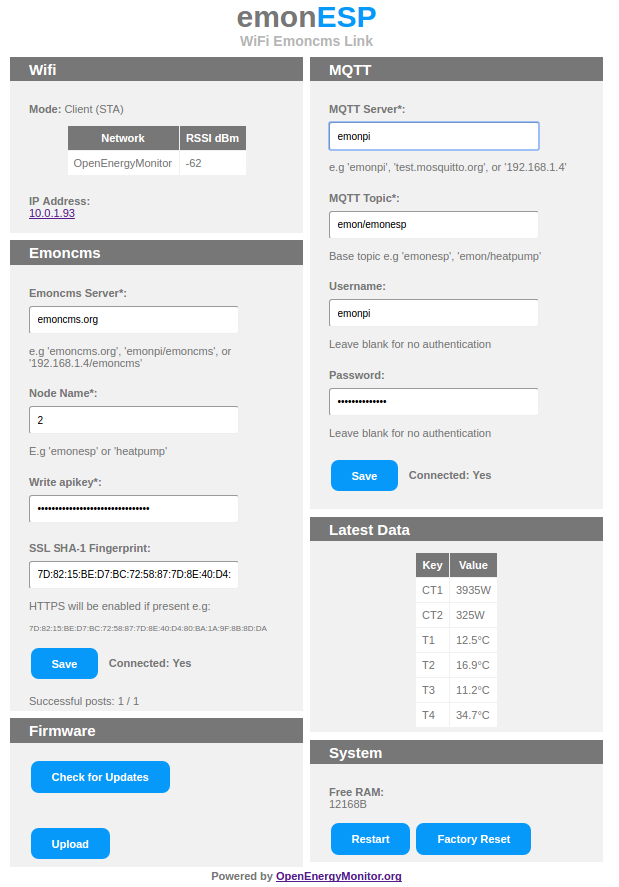
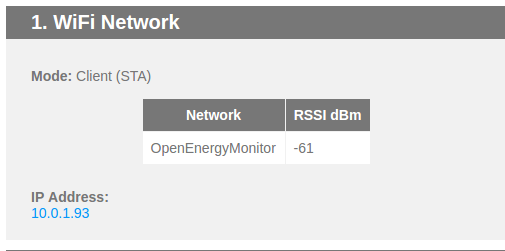
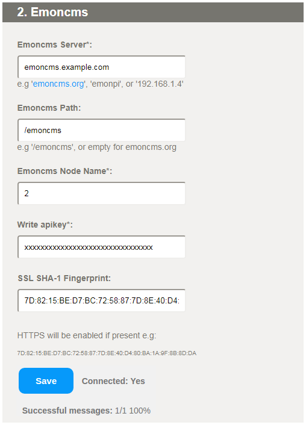
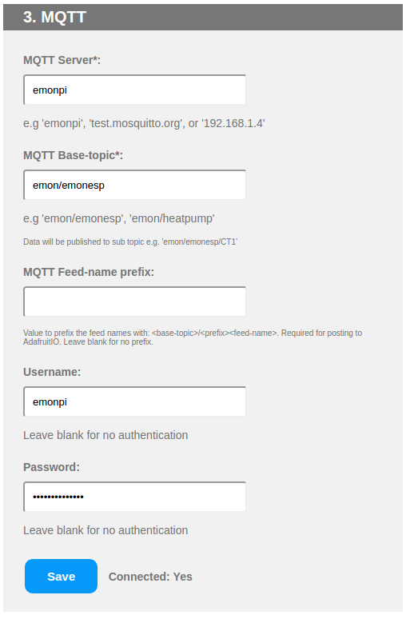
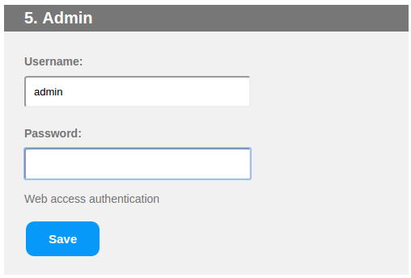
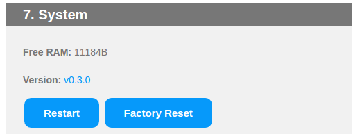

# EmonESP

[](https://travis-ci.org/openenergymonitor/EmonESP)

ESP8266/ESP32 WIFI serial to emoncms link

For applications that only require basic posting of data from one emonTx to a remote server such as Emoncms.org an emonTx with this WiFi module provides a lower cost route than an emonBase or emonPi base-station installation.

#*The core of EmonESP is also used for [emonPixel](https://github.com/openenergymonitor/emonpixel) and [OpenEVSE ESP WiFi 2.0](https://github.com/OpenEVSE/ESP8266_WiFi_v2.x).*



## Contents

<!-- toc -->
- [EmonESP](#emonesp)
  * [Requirements](#requirements)
- [EmonESP User Guide](#emonesp-user-guide)
  * [Hardware Setup](#hardware-setup)
  * [First Setup](#first-setup)
    + [1. WiFi Connection](#1-wifi-connection)
  * [2. Emoncms](#2-emoncms)
  * [3. MQTT](#3-mqtt)
  * [5. Admin (Authentication)](#5-admin-authentication)
  * [7. System](#7-system)
  * [OTA Firmware Update](#ota-firmware-update)
  * [HTTP API Examples](#http-api-examples)
    + [View units status:](#view-units-status)
    + [4. Data Input](#4-data-input)
      - [UART Input](#uart-input)
      - [HTTP API](#http-api)
    + [Save Emoncms server details](#save-emoncms-server-details)
    + [Save Emoncms MQTT server details](#save-emoncms-mqtt-server-details)
  * [Installation](#installation)
    + [Option 1: Using PlatformIO](#option-1-using-platformio)
      - [1a. Install PlatformIO command line](#1a-install-platformio-command-line)
      - [1b. And / Or use PlatformIO IDE](#1b-and--or-use-platformio-ide)
      - [2. Clone this repo](#2-clone-this-repo)
      - [3. Compile](#3-compile)
      - [3. Upload](#3-upload)
        * [a.) Upload main program:](#a-upload-main-program)
        * [b.) Upload data folder to the file system (html, CSS etc.) (SPIFFS):](#b-upload-data-folder-to-the-file-system-html-css-etc-spiffs)
      - [Or upload all in one go](#or-upload-all-in-one-go)
        * [c.) OTA upload over local network](#c-ota-upload-over-local-network)
      - [4. Debugging ESP subsystems](#4-debugging-esp-subsystems)
    + [Option 2: Using Arduino IDE](#option-2-using-arduino-ide)
      - [1. Install ESP for Arduino IDE with Boards Manager](#1-install-esp-for-arduino-ide-with-boards-manager)
      - [2. Install ESP filesystem file uploader](#2-install-esp-filesystem-file-uploader)
      - [3. Clone this repo](#3-clone-this-repo)
      - [4. Compile and Upload](#4-compile-and-upload)
    + [Troubleshooting Upload](#troubleshooting-upload)
      - [Erase Flash](#erase-flash)
      - [Fully erase ESP-12E](#fully-erase-esp-12e)
    + [Development Forum Threads](#development-forum-threads)
    + [License](#license)

<!-- tocstop -->


# Requirements

- ESP-12E module with 4M Flash
OR
- ESP32

***

# User Guide

## Hardware Setup

- [Purchase a pre-loaded ESP8266](https://shop.openenergymonitor.com/esp8266-wifi-adapter-for-emontx/)
- To connect an ESP to emonTx see [This User Guide Section](https://guide.openenergymonitor.org/setup/esp8266-adapter-emontx/)

## First Setup

On first boot, ESP should broadcast a WiFI AP `emonESP_XXX`. Connect to this AP and the [captive portal](https://en.wikipedia.org/wiki/Captive_portal) should forward you to the log-in page. If this does not happen navigate to `http://192.168.4.1`

*Note: You may need to disable mobile data if connecting via a Android 6 device*

### 1. WiFi Connection


- Select your WiFi network from list of available networks
- Enter WiFi PSK key then click `Connect`


- emonESP should now connect to local wifi network and return local IP address.
- Browse to local IP address by clicking the hyperlink (assuming your computer is on the same WiFi network)
On future boots EmonESP will automatically connect to this network.

*Note: on some networks it's possible to browse to the EmonESP using hostname [http://emonesp](http://emonesp) or on windows [http://emonesp.local](http://emonesp.local)*

**If re-connection fails (e.g. network cannot be found) the EmonESP will automatically revert back to WiFi AP mode after a short while to allow a new network to be re-configued if required. Re-connection to existing network will be attempted every 5min.**

*Holding the `boot` button at startup (for about 10's) will force AP mode. This is useful when trying to connect the unit to a new WiFi network.*




## 2. Emoncms



EmonESP can post data to [emoncms.org](https://emoncms.org) or any other  Emoncms server (e.g. emonPi) using [Emoncms API](https://emoncms.org/site/api#input).

In the *Emoncms Server* field, enter just the hostname or address without any path (e.g. emoncms.org), in the *Emoncms Path* field enter the path including the leading slash (e.g. /emoncms) or leave it empty if not required.

Data can be posted using HTTP or HTTPS. For HTTPS the Emoncms server must support HTTPS (emoncms.org does, emonPi does not). Due to the limited resources on the ESP the SSL SHA-1 fingerprint for the Emoncms server certificate must be manually entered and regularly updated.

*Note: the emoncms.org fingerprint will change every 90 days when the SSL certificate is renewed.*

To obtain the certificate fingerprint, you can use several methods, some examples:
* Chrome under Windows: click the secure icon next to the address bar and click on the certificate row to get the details, in the *Details* tab copy the hexadecimal digits from the box *Thumbprint* substituting spaces with colons and paying attention not to include any leading invisible character;
* Firefox under Linux: click the secure icon next to the address bar, Show connection details, More information, in the security tab click *View Certificate* and copy the *SHA1 Fingerprint*
* openssl under Linux: issue the following command substituting your host in place of www.example.com:

`echo | openssl s_client -connect www.example.com:443 -servername www.example.com |& openssl x509 -fingerprint -sha1 -noout`

## 3. MQTT




EmonESP can post data to an MQTT server. Each data key:pair value will be published to a sub-topic of base topic.E.g data `CT1:346` will results in `346` being published to `<base-topic>/CT1`

- Enter MQTT server host and base-topic
- (Optional) Enter server authentication details if required
- Click connect
- After a few seconds `Connected: No` should change to `Connected: Yes` if connection is successful. Re-connection will be attempted every 10s.

*Note: `emon/xxxx` should be used as the base-topic if posting to emonPi MQTT server if you want the data to appear in emonPi Emoncms. See [emonPi MQTT docs](https://guide.openenergymonitor.org/technical/mqtt/).*


## 5. Admin (Authentication)

HTTP Authentication (highly recomended) can be enabled by saving admin config by default username and password

**HTTP authentication is required for all HTTP requests including input API**



## 7. System

Displays free system memory and firmware version



## OTA Firmware Update

TBC

## HTTP API Examples

### View units status:

`http://<IP-ADDRESS>/status`

Example return in JSON:

```
{"mode":"STA","networks":[],"rssi":[],"ssid":"OpenEnergyMonitor","srssi":"-58","ipaddress":"10.0.1.93","emoncms_server":"emoncms.org","emoncms_node":"emonesp","emoncms_apikey":"xxxxxxxx","emoncms_connected":"0","packets_sent":"0","packets_success":"0","mqtt_server":"emonpi","mqtt_topic":"emonesp","mqtt_user":"emonpi","mqtt_pass":"xxxxxx","mqtt_connected":"0","free_heap":"25040"}
```

### 4. Data Input

Data can be inputed to EmonESP via serial UART or HTTP API.


#### UART Input

Data in serial:pairs string format can be inputed to EmonESP via serial UART **(115200 baud)** e.g:

`ct1:3935,ct2:325,t1:12.5,t2:16.9,t3:11.2,t4:34.7`

#### HTTP API

Data in string:pairs can be sent to EmonESP via HTTP API. This is useful to emulate the serial string data function while using the UART for code upload and debug. API example:

`http://<IP-ADDRESS>/input?string=ct1:3935,ct2:325,t1:12.5,t2:16.9,t3:11.2,t4:34.7`

### Save Emoncms server details

`http://<IP-ADDRESS>/saveemoncms?&server=emoncms.org&apikey=xxxxxxxxxxxxxxxxxx&node=emonesp&fingerprint=7D:82:15:BE:D7:BC:72:58:87:7D:8E:40:D4:80:BA:1A:9F:8B:8D:DA`

*SSL SHA-1 fingerprint is optional, HTTPS connection will be enabled if present*

### Save Emoncms MQTT server details

`http://<IP-ADDRESS>/savemqtt?&server=emonpi&topic=emonesp&user=emonpi&pass=emonpimqtt2016`

*MQTT user and pass are optional, leave blank for connection to un-authenticated MQTT servers*

***

## Installation 

EmonESP uses [ESP8266 Arduino core](https://github.com/esp8266/Arduino) or the [ESP32 Arduino core](https://github.com/espressif/arduino-esp32)

Firmware can be compiled and uploaded either using PlatfomIO ([see blog post](https://blog.openenergymonitor.org/2016/06/platformio/)) or Arduino IDE.


### Option 1: Using PlatformIO

For more detailed ESP8266 Arduino core specific PlatfomIO notes see: https://github.com/esp8266/Arduino#using-platformio

#### 1a. Install PlatformIO command line

The easiest way if running Linux is to install use the install script, this installed pio via python pip and installs pip if not present. See [PlatformIO installation docs](http://docs.platformio.org/en/latest/installation.html#installer-script). Or PlatformIO IDE can be used :

`$ sudo python -c "$(curl -fsSL https://raw.githubusercontent.com/platformio/platformio/master/scripts/get-platformio.py)"`

#### 1b. And / Or use PlatformIO IDE

Standalone built on GitHub Atom IDE, or use PlatformIO Atom IDE plug-in if you already have Atom installed. The IDE is nice, easy and self-explanitory.

[Download PlatfomIO IDE](http://platformio.org/platformio-ide)

#### 2. Clone this repo

`$ git clone https://github.com/jdeglavina/EmonESP`

#### 3. Compile

```
$ cd EmonESP
$ pio run
```

The first time platformIO is ran the espressif arduino tool chain and all the required libs will be installed if required.


#### 3. Upload

- Put ESP into bootloader mode
   - On Heatpump monitor use jumper to pull `GPIO0` low then reset then connect power (simulates reset) or pull RST pin low.
   - On other ESP boards (Adafruit HUZZAH) press and hold `GPIO0` button then press Reset, LED should light dimly to indicate bootloader mode

##### a.) Upload main program:

`$ pio run -t upload`

##### b.) Upload data folder to the file system (html, CSS etc.) (SPIFFS):

- Put ESP back into bootloder mode, see above

`$ pio run -t uploadfs`

See [PlatfomrIO docs regarding SPIFFS uploading](http://docs.platformio.org/en/latest/platforms/espressif.html#uploading-files-to-file-system-spiffs)

#### Or upload all in one go

This wil upload both the fimware and fs in a single command

Put ESP into bootloader mode

`esptool.py write_flash 0x000000 .pioenvs/emonesp/firmware.bin 0x300000 .pioenvs/emonesp/spiffs.bin`


##### c.) OTA upload over local network

`$  pio run  -t upload --upload-port <LOCAL-ESP-IP-ADDRESS>`

Upload SPIFFS filesystem over OTA (and don't flash):

` pio run -e emonesp_spiffs -t upload --upload-port <LOCAL-ESP-IP-ADDRESS>`

OTA uses port 8266. See [PlatformIO ESP OTA docs](http://docs.platformio.org/en/latest/platforms/espressif.html#over-the-air-ota-update):

#### 4. Debugging ESP subsystems

The ESP subsystems have a lot of logging that can be enabled via setting various build options.

Using Platform IO the easiest way to configure these is via the [PLATFORMIO_BUILD_FLAGS](http://docs.platformio.org/en/stable/envvars.html#envvar-PLATFORMIO_BUILD_FLAGS) environment variable.

First select the serial port to output debug;
```
-DDEBUG_ESP_PORT=Serial
-DDEBUG_ESP_PORT=Serial1
```

Then add one or more of the debug options;
```
-DDEBUG_ESP_CORE
-DDEBUG_ESP_WIFI
-DDEBUG_ESP_HTTP_CLIENT
-DDEBUG_ESP_HTTP_SERVER
-DDEBUG_ESP_HTTP_UPDATE
-DDEBUG_ESP_UPDATER
-DDEBUG_ESP_OTA
-DDEBUG_ESP_SSL
-DDEBUG_TLS_MEM
```

For example from the Windows Power shell you may do something like;
```
$env:PLATFORMIO_BUILD_FLAGS="-DDEBUG_ESP_PORT=Serial1 -DDEBUG_ESP_CORE -DDEBUG_ESP_WIFI"
pio run -t clean
pio run
pio run -t upload --upload-port 172.16.0.80
```
***

### Option 2: Using Arduino IDE

#### 1. Install ESP for Arduino IDE with Boards Manager

##### a. For ESP8266:

Install steps from: https://github.com/esp8266/Arduino

- Install Arduino IDE 1.6.8 from the Arduino website.
- Start Arduino and open Preferences window.
- At the bottom of this window find the field “Additional Board Manager URLs” and enter ‘http://arduino.esp8266.com/stable/package_esp8266com_index.json`. You can add multiple URLs, separating them with commas.
- Open `Tools > Board > Board Manager`, scroll down and click on esp8266 platform, select version then install
- Select `Tools > Board > Generic ESP8266 Module` (required for EmonESP)

##### b. For ESP32:

Install steps from: https://github.com/espressif/arduino-esp32/blob/master/docs/arduino-ide/boards_manager.md

- Install the current upstream Arduino IDE at the 1.8 level or later. The current version is at the [Arduino website](http://www.arduino.cc/en/main/software).
- Start Arduino and open Preferences window.
- Enter ```https://dl.espressif.com/dl/package_esp32_index.json``` into *Additional Board Manager URLs* field. You can add multiple URLs, separating them with commas.
- Open Boards Manager from Tools > Board menu and install *esp32* platform (and don't forget to select your ESP32 board from Tools > Board menu after installation).

Stable release link: `https://dl.espressif.com/dl/package_esp32_index.json`

Development release link: `https://dl.espressif.com/dl/package_esp32_dev_index.json`

#### 2. Install ESP filesystem file uploader

##### a. For ESP8266:

Required to include `data` folder with HTML etc in the upload

[Follow esp8266 filesystem instructions (copied  below):](https://github.com/esp8266/Arduino/blob/master/doc/filesystem.md)

- [Download the Arduino IDE plug-in (.zip)](https://github.com/esp8266/arduino-esp8266fs-plugin/releases/download/0.2.0/ESP8266FS-0.2.0.zip)
- Navigate to the `tools` folder in your Arduino sketchbook directory, (create directory if it doesn't exist)
- Create `tools > ESP8266FS` folder
- Unpack the plug-in into `ESP8266FS` directory (the path will look like `<home_dir>/Arduino/tools/ESP8266FS/tool/esp8266fs.jar`)
- Restart Arduino IDE

##### a. For ESP32:

You will need the latest release from this page: https://github.com/me-no-dev/arduino-esp32fs-plugin/releases

Then follow instructions from here: https://github.com/me-no-dev/arduino-esp32fs-plugin

- In your Arduino sketchbook directory, create tools directory if it doesn't exist yet.
- Unpack the tool into tools directory (the path will look like ```<home_dir>/Arduino/tools/ESP32FS/tool/esp32fs.jar```).
- Restart Arduino IDE. 


#### 3. Clone this repo

`$ git clone https://github.com/jdeglavina/EmonESP`

#### 4. Compile and Upload

- Open src/src.ino in the Arduino IDE.
- Put ESP into bootloader mode
   - On Heatpump monitor use jumper to pull `GPIO0` low then reset then connect power (simulates reset)
   - On other ESP boards (Adafruit HUZZAH) press and hold `GPIO0` button then press Reset, LED should light dimly to indicate bootloader mode
- **Upload main sketch:** Compile and Upload as normal using Arduino IDE [CTRL + u]
- **Upload 'data' folder**: Upload data folder (home.html web page etc) using `tools > ESP8266/ESP32 Sketch Data Upload tool`


### Troubleshooting Upload

#### Library errors 

- If compiling fails because PubSubClient.h library cannot be found. Open the Library Manager again (Sketch > Include Library > Library Manager) and search for 'PubSubClient', install.
- For the ESP32, you will probably need these libraries (installed to Arduino/libraries):
    - https://github.com/me-no-dev/AsyncTCP
    - https://github.com/me-no-dev/ESPAsyncWebServer
- If you get an error for hash.h, put a folder under Arduino/libraries "Hash" and load it with these files: https://github.com/esp8266/Arduino/tree/master/libraries/Hash/src

#### Erase Flash

If you are experiencing ESP hanging in a reboot loop after upload it may be that the ESP flash has remnants of previous code (which may have the used the ESP memory in a different way). The ESP flash can be fully erased using [esptool](https://github.com/themadinventor/esptool). With the unit in bootloder mode run:

`$ esptool.py erase_flash`

*`sudo` maybe be required*

Output:

```
esptool.py v1.2-dev
Connecting...
Running Cesanta flasher stub...
Erasing flash (this may take a while)...
Erase took 8.0 seconds
```

#### Fully erase ESP-12E

To fully erase all memory locations on an ESP-12 (4Mb) we need to upload a blank file to each memory location

`esptool.py write_flash 0x000000 blank_1MB.bin 0x100000 blank_1MB.bin 0x200000 blank_1MB.bin 0x300000 blank_1MB.bin`

***

### Development Forum Threads

- https://community.openenergymonitor.org/t/emonesp-firmware-development/1191/43
- https://community.openenergymonitor.org/tags/emonesp

### License

GNU V3 General Public License
